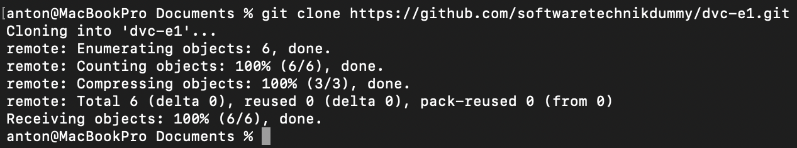
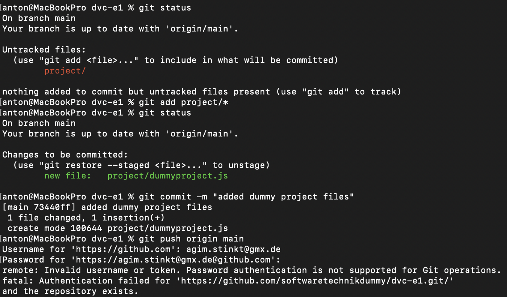
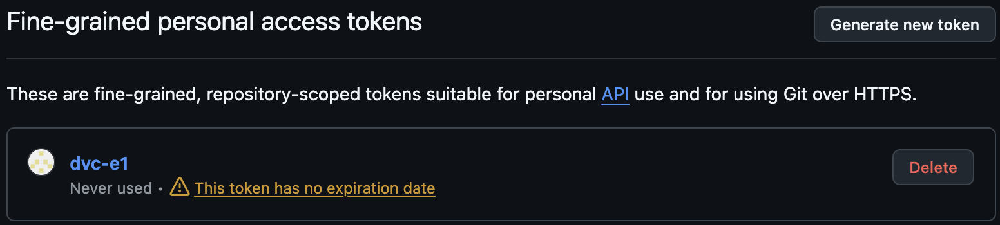
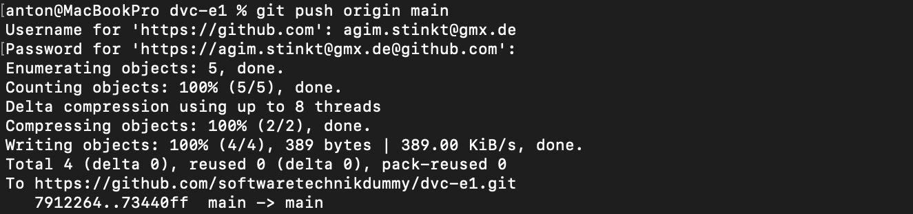

# Aufgabe 2

## Clone to local
Als erstes habe ich das Repository gecloned, das funktionierte einwandfrei

## Initial push (fail)
Der erste Versuch, die Änderungen zu pushen schlug fehl, da reguläre Passwortauthentifizierung nicht unterstützt wird.

## Personal Access Token

Ich erstellte mir also ein für das Repository berechtigtes Personal-Access-Token.
Damit anstelle des Passworts funktionierte der push-Befehl sofort.

