# Aufgabe 3

## pull
Nachdem ich für Aufgabe 2 die Dokumentation in der GitHub-Oberfläche ins Repository eingepflegt habe, muss ich diese Änderungen lokal pullen:

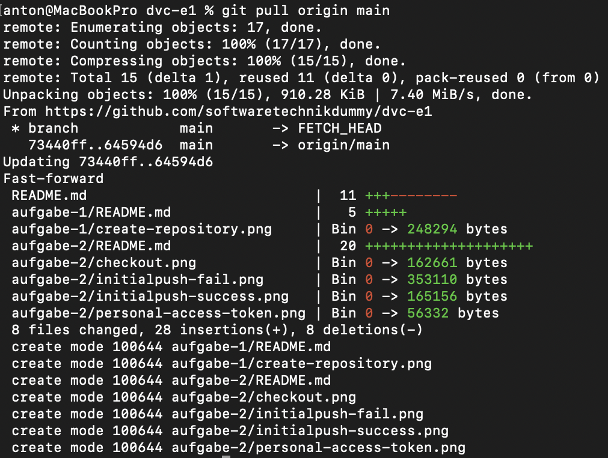

## status & diff
Eine kleine Änderung im Code wurde vorgenommen und ich prüfe mittels `git status` und `git diff`, was genau passiert ist.

Wie erwartet, werde ich bei `git status` dazu aufgefordert, die modifizierte Datei mittels `git add` aufzunehmen.

Zusätzlich zeigt `git diff` anschaulich, welche Codeänderungen genau vorgenommen wurden:

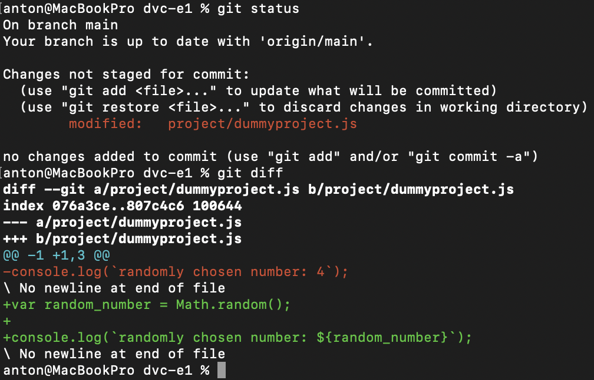

## add & diff
Nachdem die Änderungen mittels `git add` gestaged wurden, kann ich nun mit `git status` sehen, dass alles bereit für den commit ist. Auch `git diff` zeigt nun keine Änderungen mehr an. Wenn ich allerdings `git diff --cached` ausführe, vergleicht der Befehl den staged Code mit dem letzten pull und wir sehen die Änderungen wieder im Detail:

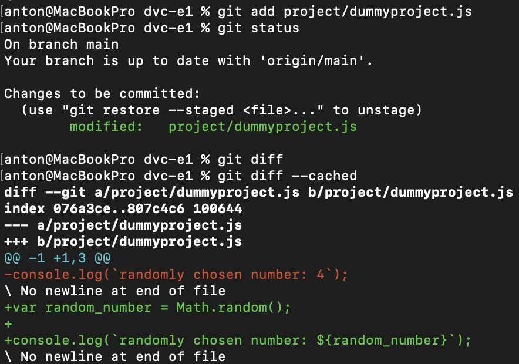

## diff HEAD
Nun ändere ich nochmal etwas im Code und kann mittels `git diff HEAD` die staged & unstaged Änderungen sehen.

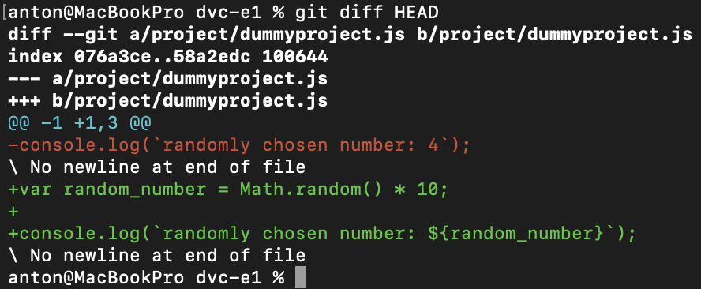

## commit & push
Jetzt stage ich schnell meine zweite Änderung und führe `git commit` aus. Anschließend pushe ich den aktuellen Stand in den main branch meines Repositories:

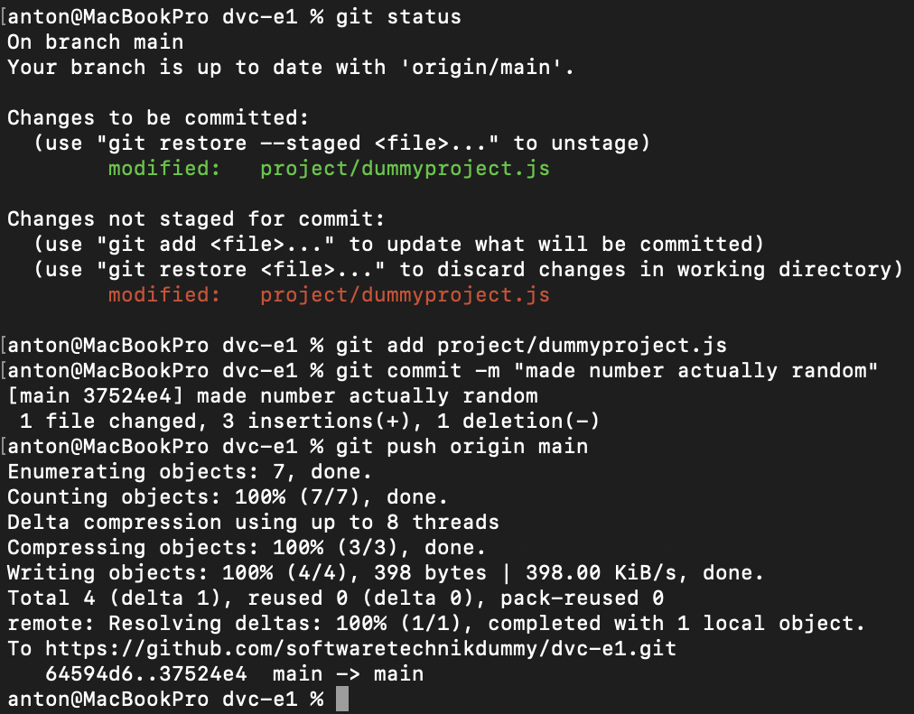

## mv
Nachdem des Projekt in Fahrt kommt, ist der Dateiname `dummyproject.js` nicht mehr angemessen. Doch um nicht unnötig viele Befehle ausführen zu müssen, kann ich mittels `git mv` die Datei sauber verschieben und den Vorgang gleichzeitig stagen:

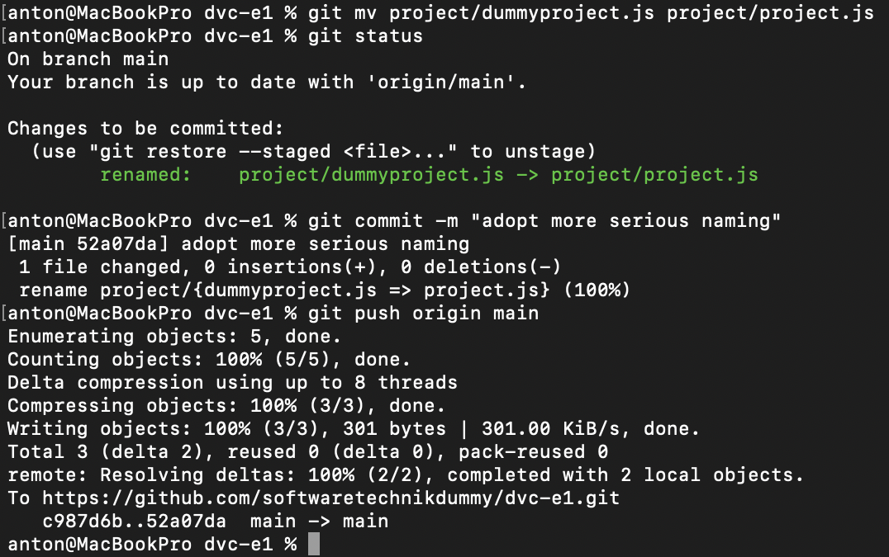

## rm
Plötzlich fällt auf, dass ich ausversehen `project/test.js` und `project/local_file.js` in das Repository gepusht habe. Die erste Datei ist obsolet und soll komplett gelöscht werden, während die zweite Datei weiterhin für meine lokale Testumgebung relevant ist, nicht aber im Repository.

Mittels `git rm` kann ich ähnlich wie bei `git mv` das Löschen und Stagen vereint durchführen:

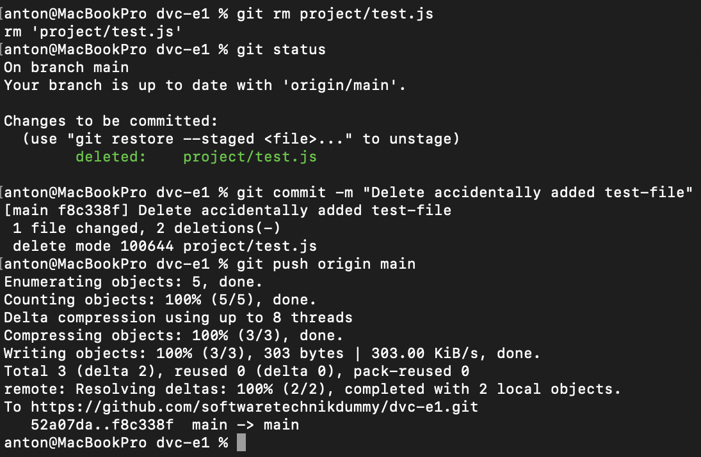

Bei der zweiten Datei füge ich `--cached` als Parameter hinzu, um die Datei im lokalen clone des Repositories ungetracked beizubehalten:

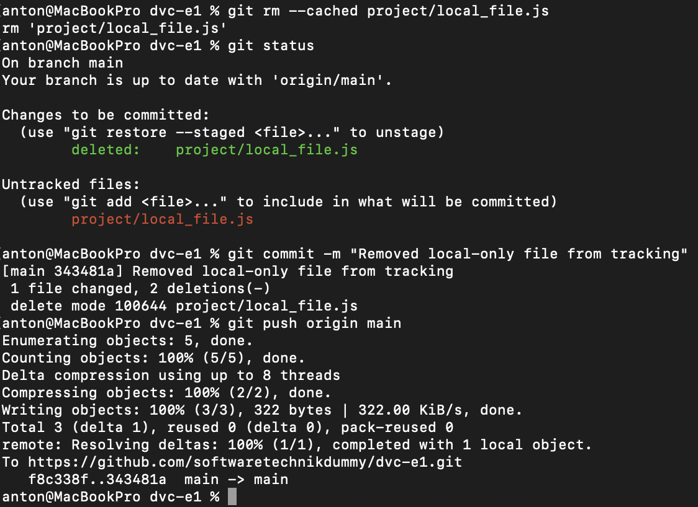

## log & config
Mit `git log` möchte ich meine commit-Historie anzeigen lassen und mir fällt auf, dass mein Benutzername und meine E-Mail inkonsistent sind:

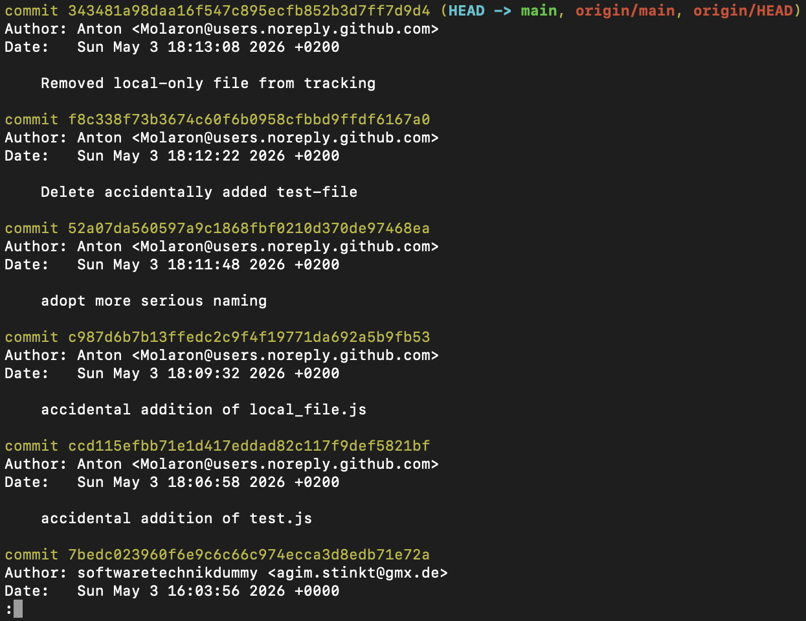

Ich entschließe mich mittels `git config` meinen BHT-Benutzernamen und die zugehörige E-Mail zu verwenden:

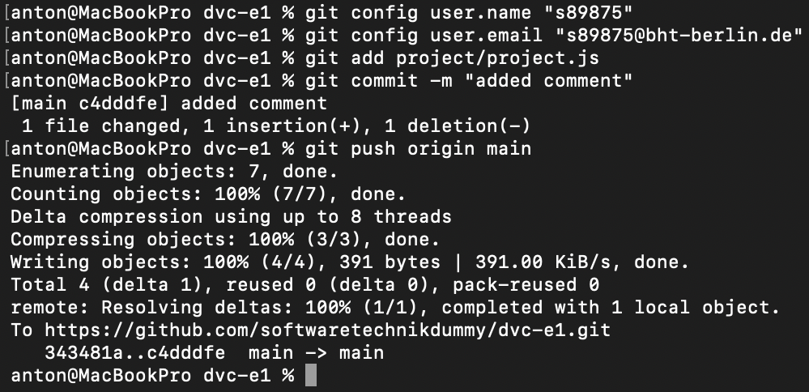

Mittels `git log` verifiziere ich, dass der neueste Commit nun die richtigen Metadaten enthält:

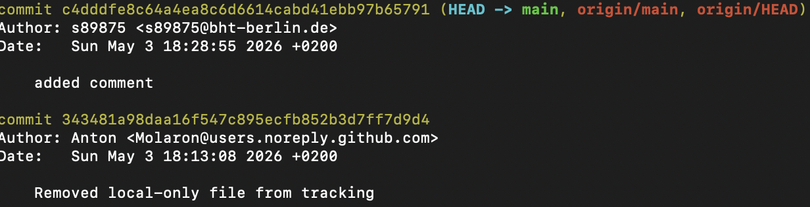