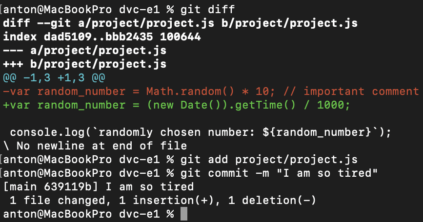
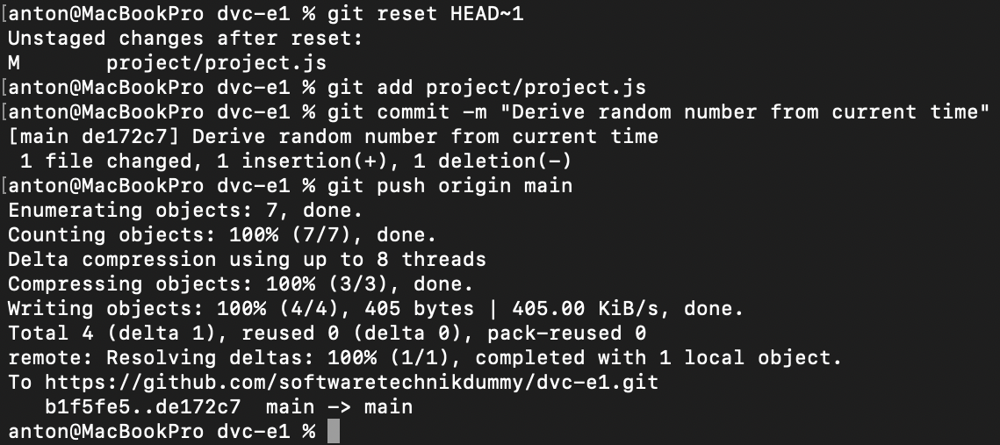
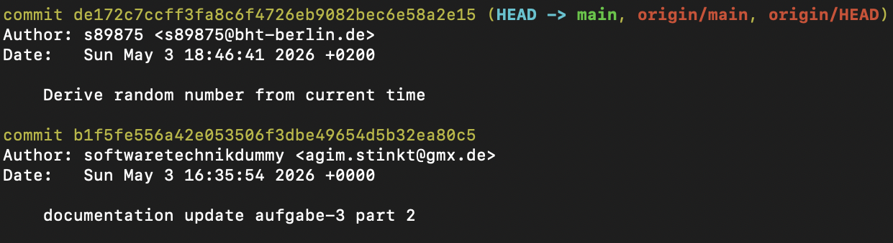
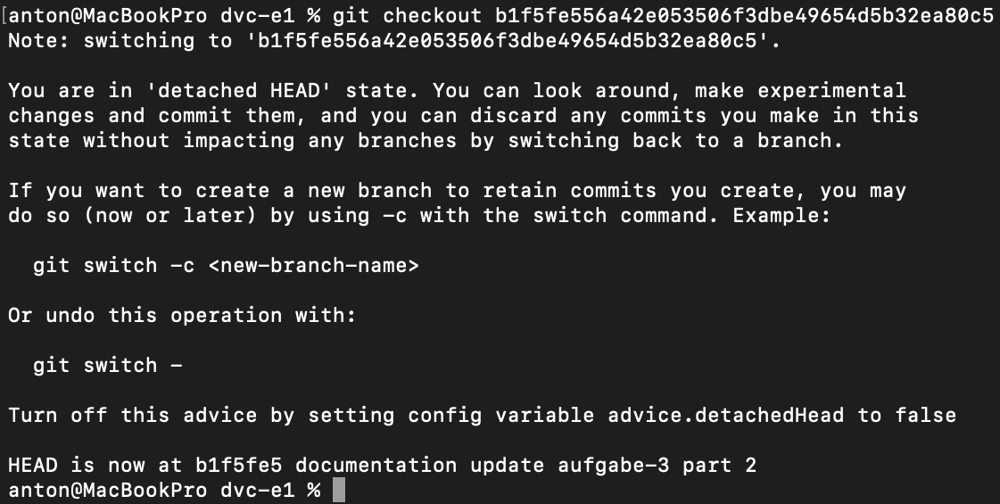
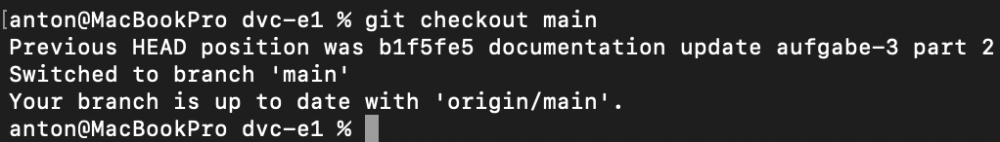
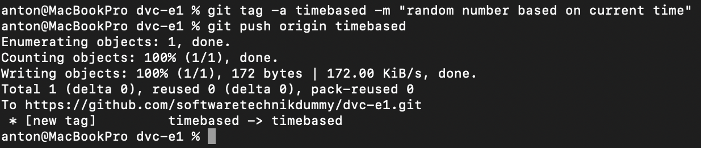
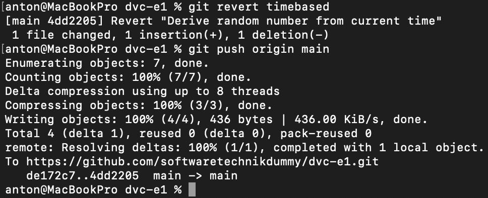

# Aufgabe 4

## undo commit
Spät in der Nacht habe ich beim Arbeiten ausversehen eine sinnlose commit-Message angegeben:

Mittels `git reset HEAD~1` konnte ich den letzten Commit rückgängig machen und nochmal von vorne anfangen:

## checkout
Doch dann wollte ich meinem Kollegen den Unterschied der letzten Änderung live zeigen und musste schnell die alte Version lauffähig bekommen. Dafür schaute ich mittels `git log` nach, welchen commit-hash ich auschecken muss:

Dann konnte ich schnell meine lokale Umgebung in der Zeit zurückreisen lassen:

Nachdem wir den alten Code ausgeführt hatten, wollte ich wieder am aktuellen Stand weiterarbeiten. Mit `git checkout main` war ich innerhalb kürzester Zeit wieder in der Gegenwart:

## tagging
Weil das mit `git log` und dem commit-hash so umständlich war, entschied ich mich den aktuellen Stand mit einem Tag zu markieren:

## revert
Am nächsten Morgen wird mir dann doch klar, dass die Arbeit von vorher komplett sinnlos war und ich entscheide mich, die letzte Änderung rückgängig zu machen. Hier kommt mir `git revert` zur Hilfe und ich kann sogar mein gerade gesetztes Tag benutzen, um keinen commit-hash heraussuchen zu müssen:

