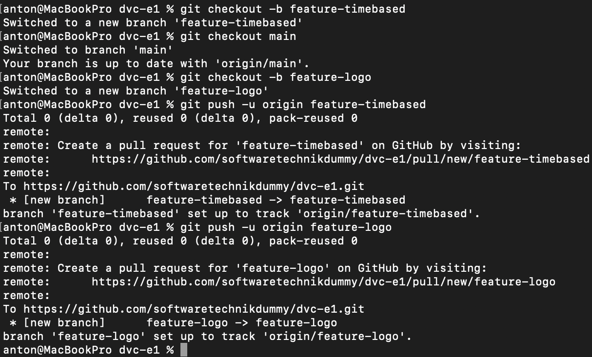
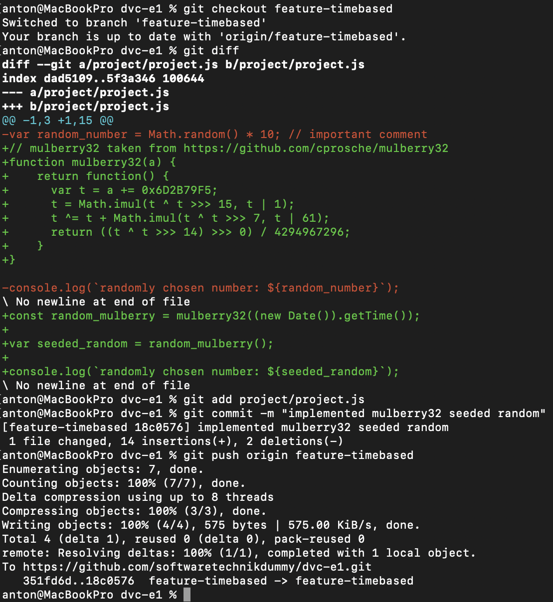
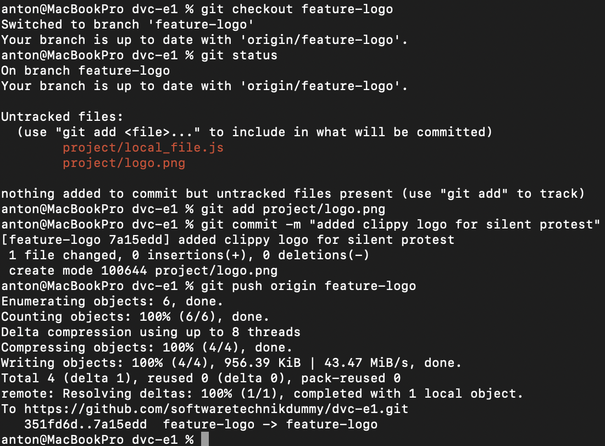
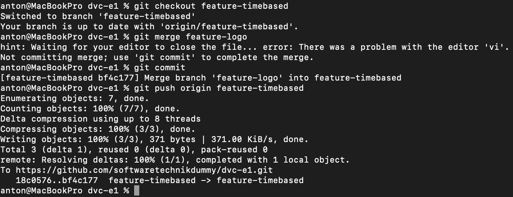
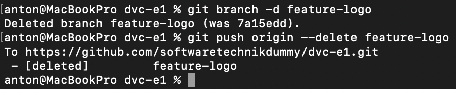
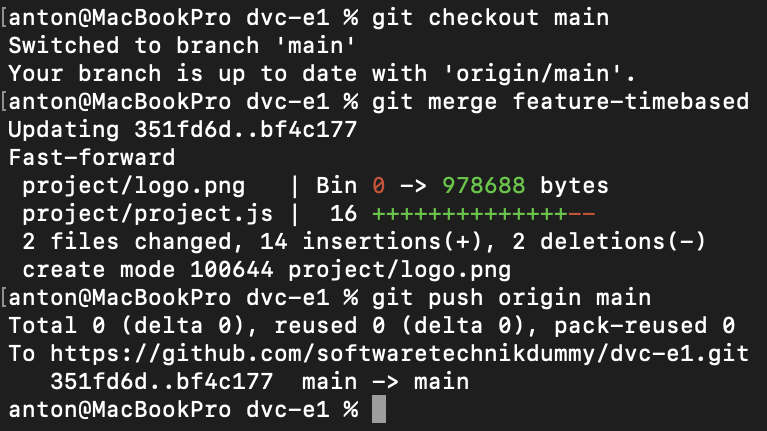

# Aufgabe 5

## create branches
Ich möchte zeitgleich daran arbeiten, den random number generator mit der aktuellen Uhrzeit seeden können und ein Logo für das Projekt finden.
Deshalb erstelle ich für beide Arbeiten einen jeweils eigenen Branch:

## mulberry32

Ich implementiere mulberry32 im branch `feature-timebased` und erreiche damit rng mit time-seed:

## logo

Die Logoentscheidung fällt mir nach dem Anschauen [eines Videos von Louis Rossmann](https://www.youtube.com/watch?v=2_Dtmpe9qaQ) nicht schwer:

## merge features

Da das Logo fertig entwickelt ist, kann ich es bereits in den `feature-timebased` branch mergen, ohne den main-branch zu verändern:

Den Logo-Branch brauche ich nicht mehr und lösche ihn:

## merge main

Jetzt fällt mir auf, dass auch der timebased branch gut implementiert ist und ich den main-branch auf den neuesten Stand bringen kann. Diesmal belasse ich den branch `feature-timebased` aber, um die Arbeit an diesem Feature dokumentiert zu lassen:

