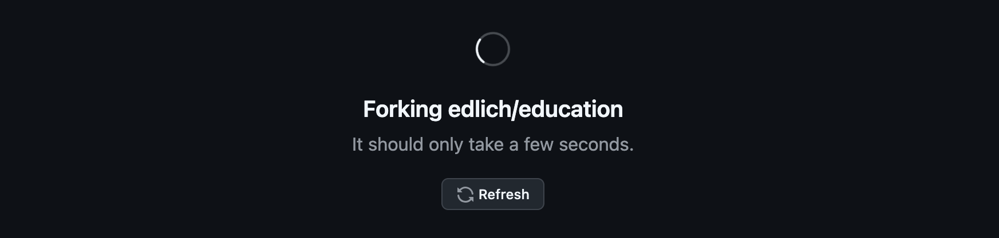
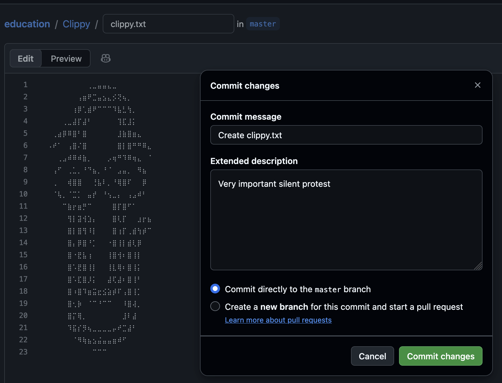
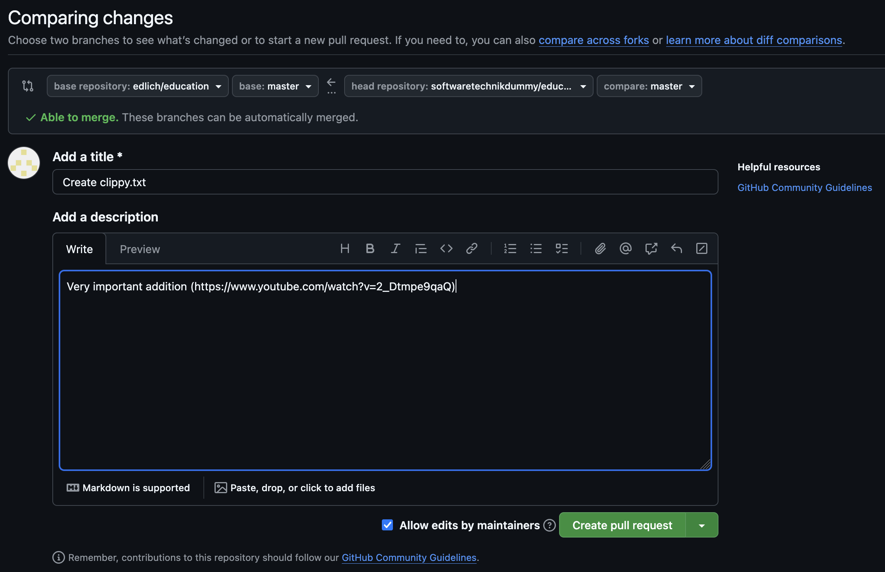
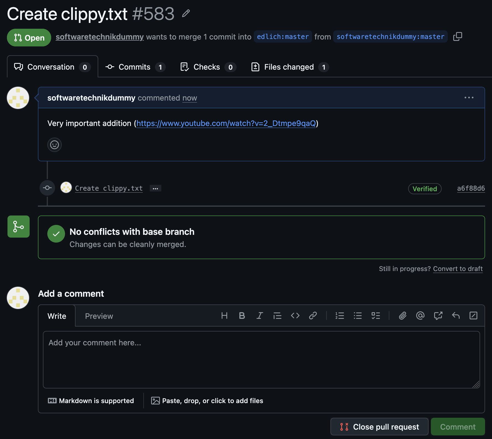

# Aufgabe 6

## forking
Als erstes habe ich das Repository geforked:

## committing
Meine eigene Änderung habe ich in meinen Fork committed:

## pullrequest
Dann musste [ein Pullrequest](https://github.com/edlich/education/pull/583) erstellt werden:

Jetzt warte ich auf ein approval:

